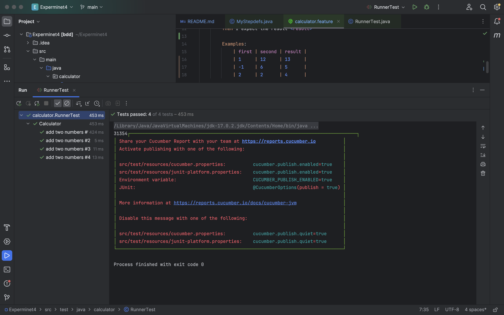
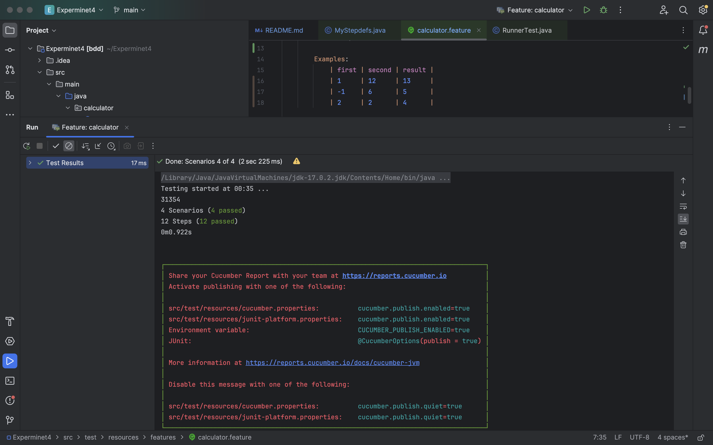

# Experminet4

## Example PDF

از آنجایی که هنوز در قسمت تست ورودی اعداد منفی را در نظر نگرفتیم در زمان اضافه کردن Scenario Outline جدید که عدد ورودی می‌دهد به ارور step undefined برمی‌خوریم.

با تغییر کد MyStepdefs که اعداد منفی را نیز به عنوان ورودی قبول کند مشکل این سناریو‌ را برطرف می‌کنیم. تنها کافی است به جای استفاده از (\d+) در رجکس یک منفی آپشنال نیز قبل آن در نظر بگیریم و (-?\d) را در نظر بگیریم.

